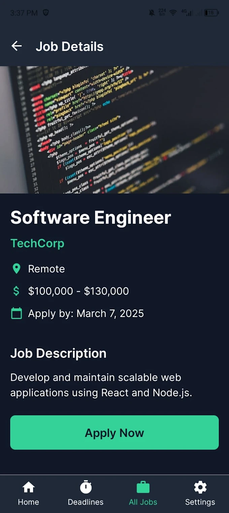
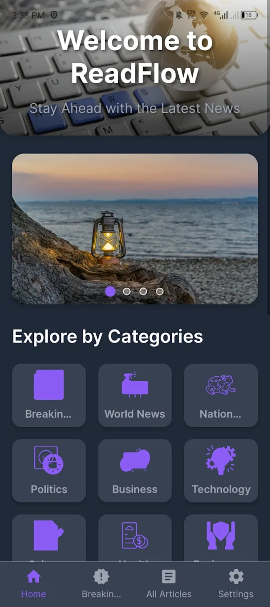
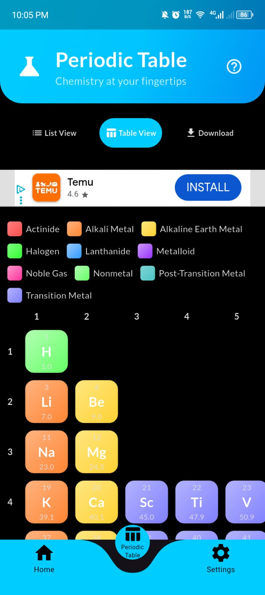
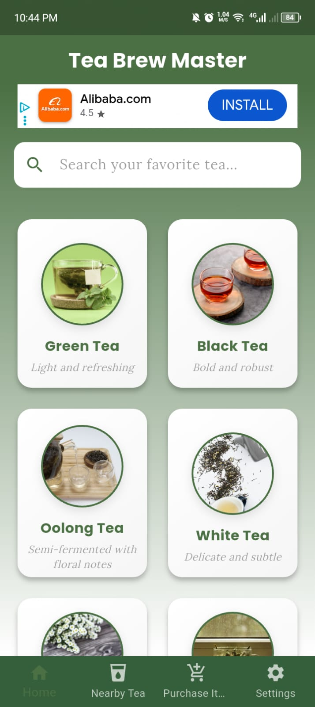
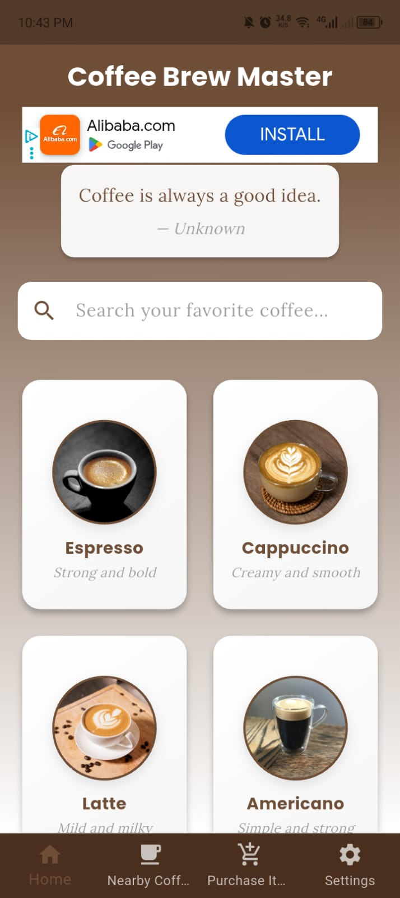
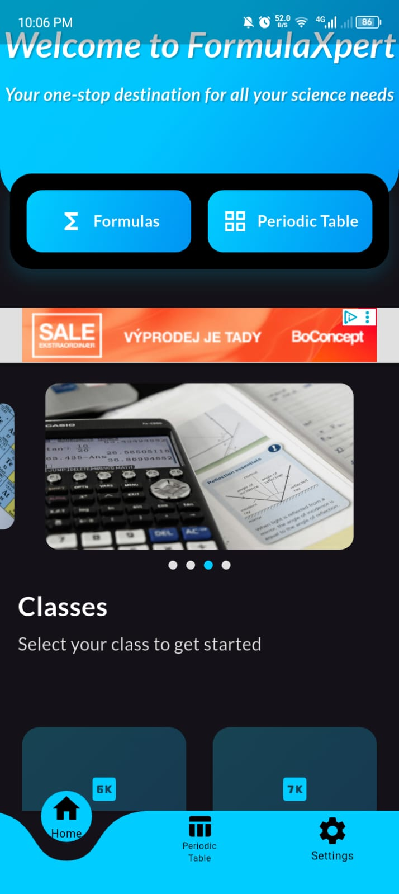

# 🚀 React Native, Expo, Flutter & Mobile App Portfolio

Welcome to my mobile and frontend projects portfolio! This repository showcases **6 deployed apps** (3 Expo React Native, 3 Flutter) plus web frontend work — demonstrating cross-platform mobile development, clean UX, and production-ready releases. I will not open the code as they are deployed and used as business uses.

> Each mobile entry below has a short description, key features, platform badges (replace with real links), and a screenshot placeholder you can swap with your images.

---

## 📱 Mobile Apps (React Native & Flutter)

### Expo — React Native Apps

> Built with **Expo (React Native)** for fast iteration and smooth cross-platform UX.

---

#### **JobSeek**

* **Short description:** A lightweight job-search app that helps users discover, filter, and apply to local and remote job listings quickly.
* **Key features:**

  * Advanced search & filters (location, job type, salary)
  * Save jobs, apply from the app, and track application status
  * User profile with resume upload
  * Push notifications for saved-search alerts
* **Platforms:** iOS & Android
* **Store:** [App Store Link](#) | [Play Store Link](#)
* 

---

#### **ReadFlow**

* **Short description:** A clean, distraction-free reading app for articles and long-form content with offline reading and personalised reading lists.
* **Key features:**

  * Save, organize, and tag articles
  * Read-later / offline mode with text resizing
  * Dark mode and adjustable line spacing for accessibility
  * Built-in text-to-speech for hands-free listening
* **Platforms:** iOS & Android
* **Store:** [App Store Link](#) | [Play Store Link](#)
* 

---

#### **E-Learning Application**

* **Short description:** A student-focused e-learning app that delivers bite-sized lessons, quizzes, and progress tracking for effective self-study.
* **Key features:**

  * Topic-based lesson modules and interactive quizzes
  * Bookmark lessons and track learning progress
  * Download lessons for offline access
  * Simple analytics to review strengths and weak areas
* **Platforms:** iOS & Android
* **Store:** [App Store Link](#) | [Play Store Link](#)
* 

---

### Flutter Apps

> Built with **Flutter** for expressive UI and high-performance native experience.

---

#### **Coffee Brew Master**

* **Short description:** A specialty coffee companion app for brew recipes, timers, and tasting notes aimed at home baristas.
* **Key features:**

  * Step-by-step brew recipes (Pour-over, French press, AeroPress)
  * Built-in brew timers and strength calculators
  * Save tasting notes and favorite recipes
  * Share recipes with community links
* **Platforms:** iOS & Android
* **Store:** [App Store Link](#) | [Play Store Link](#)
* 

---

#### **Tea Brew Master**

* **Short description:** A curated tea brewing guide with steeping times, water temperature suggestions, and flavor profiles for different tea types.
* **Key features:**

  * Library of teas with steeping instructions
  * Custom brew planner and reminders
  * Personal notes and rating system
  * Offline access to saved guides
* **Platforms:** iOS & Android
* **Store:** [App Store Link](#) | [Play Store Link](#)
* 

---

#### **Formula Expert**

* **Short description:** A practical utility app for professionals and students that provides calculators and reference formulas across physics, chemistry, and math.
* **Key features:**

  * Quick access to common formulas and unit converters
  * Step-by-step solution workflow for calculations
  * Save frequently used formulas and create custom entries
  * Clean, searchable UI with dark mode
* **Platforms:** iOS & Android
* **Store:** [App Store Link](#) | [Play Store Link](#)
* 

---

## 📞 Contact & Links

Have questions or want to collaborate?

* **Email:** [Email](mailto:mdzhasancz@gmail.com)
* **Website / Portfolio:** [My website](https://zahids-portfolio.web.app)
* **LinkedIn:** [LinkedIn](https://linkedin.com/in/hasanmd1)
